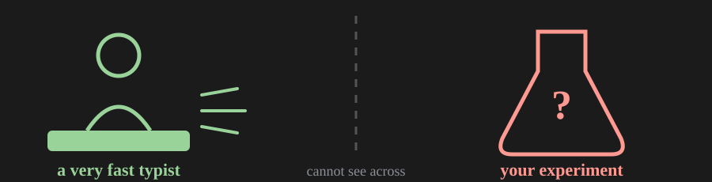
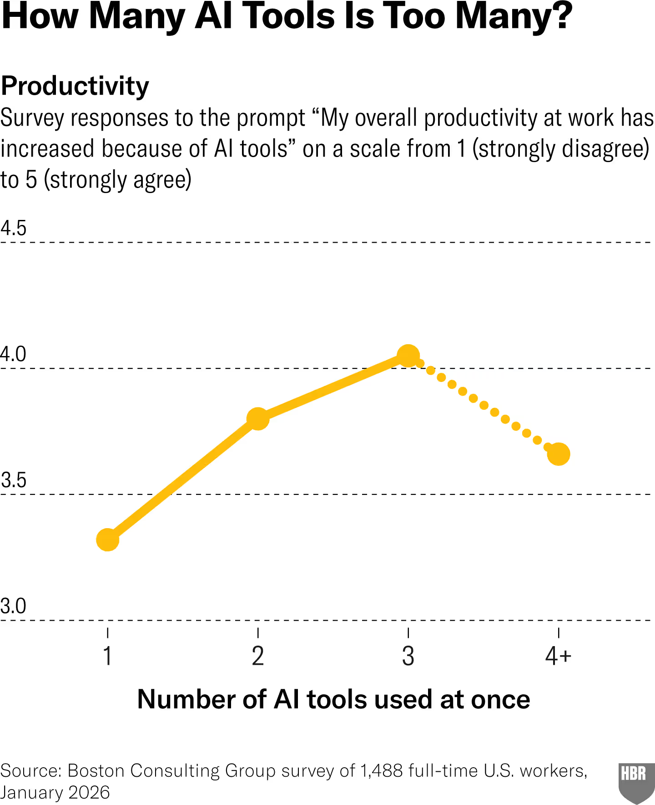
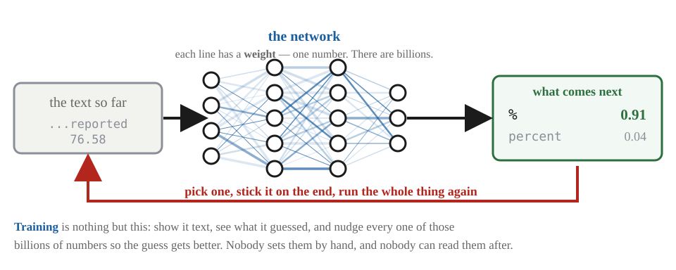
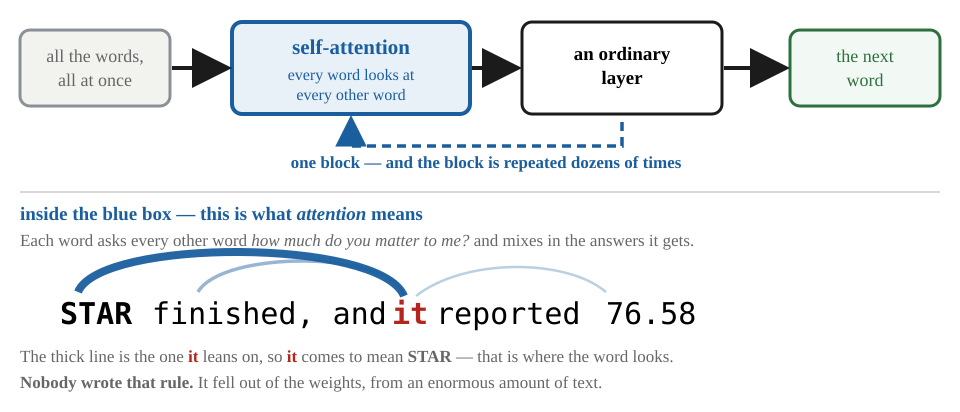
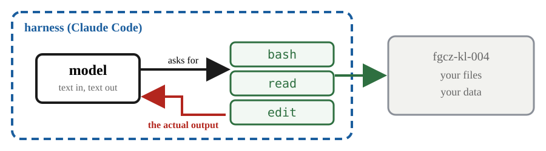
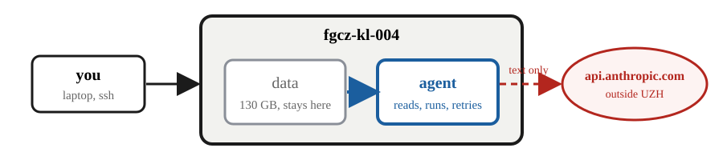
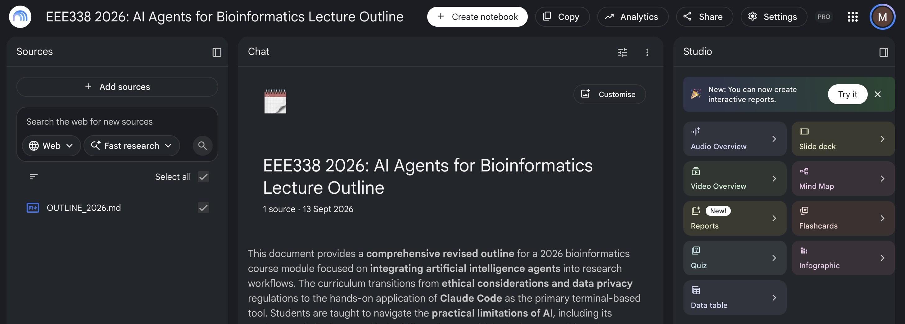

# AI Agents for Bioinformatics — part 1

**EEE338 — Next Generation Sequencing for Evolutionary Functional Genomics**
University of Zurich / FGCZ · Masaomi Hatakeyama
**17 September 2026 · one hour**

This is the reading version of the slides for the hour on 17 September. It is
the same content as `EEE338_2026_AI_Agents_part1.html`, written out so that it
can be read on GitHub and searched. The deck is the thing shown in the room;
this is the thing you come back to afterwards.

**On numbering.** The slides are numbered 2–23 across the hour, and the headings
below carry those numbers. The deck also has three divider screens between the
sections, which is why the position counter in the corner of the projected slide
runs further than 23.

From 18 September the slides continue in a second deck,
`EEE338_2026_AI_Agents_part2`, and **the numbering runs straight on** — that deck
starts at slide 24.

----

Contents — the deck's own section numbers

* [Frame](#frame) — slides 2–3
* [0. Set up](#0-set-up) — slides 4–7, **done first**
* [1. The rules that bind you](#1-the-rules-that-bind-you) — slides 8–15
* [2. The tools](#2-the-tools) — slides 16–23

----

## Slide 1 — Title

> **AI Agents for Bioinformatics**
>
> EEE338 — Next Generation Sequencing for Evolutionary Functional Genomics
> University of Zurich / FGCZ · Masaomi Hatakeyama
> 17 September 2026 · one hour

----

# Frame

*Slides 2–3 · 17 September*

## Slide 2 — What we will cover

| Session | Block |
|---|---|
| **Today** — 17 Sep · 1 h · slides 2–23 | **0. Set up** — install, your key, first screen. **We do this first.**<br>**1. The rules that bind you** — ethics, data classes, three cautions<br>**2. The tools** — what an LLM is, what an agent is, and which one for which job |
| **18 Sep** — slides 24–31 | **3. Claude Code in practice** — the two files that decide what it knows<br>**4. How it fails on our data** — the five failures, and which practical each one lives in (you run them; they are exercises, not slides)<br>**5. What you are graded on**<br>Then **at the keyboard**: the practical page `EEE338_2026_Claude_Code_part2`, and then Command Practice |

## Slide 3 — One sentence to keep

> It is a **very fast typist**, not a biologist,
> and it has **never seen your experiment**.



----

# 0. Set up

*Slides 4–7 · do this first · 17 September*

## Slide 4 — Log in first, then install it

**Getting to `fgcz-kl-004`** — two hops from your own machine, because it only
exists inside the FGCZ subnetwork:

```sh
 $ ssh username@fgcz-genomics.uzh.ch
 $ ssh fgcz-kl-004
```

`username` is the same as your **B-Fabric account**.

> **Three wrong passwords — locked out for 30 minutes.**
> **Stop at the second.** Retyping does not open it any sooner. Sign in at
> **fgcz-bfabric.uzh.ch** in a browser instead — **same account, same
> password**. If that works, the password is right and the trouble is
> elsewhere; and you still have a try in hand.

**Now install it**, on `fgcz-kl-004`:

```sh
 $ curl -fsSL https://claude.ai/install.sh | bash
   → ~/.local/bin/claude
     no root · no Node.js · no package manager · nothing outside your home
```

The same line works on `fgcz-kl-004` now (about a minute), on your own laptop
tonight if you like, and on any Linux or macOS machine.

*Sources: claude.ai/install.sh · code.claude.com/docs · fgcz-bfabric.uzh.ch*

## Slide 5 — Setting up your key

You are given a number, and `XX` below stands for it. **The table of numbers is
in section 4 of the practical page** — find yourself there, and type your own
two digits in.

```sh
 $ umask 077                                      # new files: you only
 $ cp /scratch/EEE338_2026/keys/XX ~/.eee338_key  # your own copy
 $ touch /scratch/EEE338_2026/keys_done/XX        # tells me you have it
 $ source ~/.eee338_key                           # once per login
```

`keys/XX` — only you can read it → copy once → `~/.eee338_key`, your working
copy → then I delete the shared copy.

* `source` it **once per login**. Deliberately not in `.bashrc` — you should
  notice that you are handling a credential.
* You never type the key. That is the whole reason you copy a file instead.
* Never put it in a script, a log, `ai_log.md`, or anything you hand in.
  If it leaks: **tell the lecturer**, and it is revoked.

All ten keys are revoked when the course ends.

## Slide 6 — The very first run: three prompts, one trap

```sh
 $ mkdir -p /scratch/EEE338_2026/your_name  # you do not have one yet
 $ cd /scratch/EEE338_2026/your_name
 $ claude
```

> ### Do **not** type `your_name` — type **your own name**.

1. **text style** — any one. `Enter`
2. **"use this API key?"** — **`↑` to Yes**, then `Enter`
3. **security notes** — read them. `Enter`

> **Trap — prompt 2: the cursor starts on No.**
>
> ```
> Detected a custom API key in your environment
> ANTHROPIC_API_KEY: sk-ant-...VAAA
> Do you want to use this API key?
>
>     Yes
>   ❯ No (recommended)      ← Enter here = no key, no session
> ```
>
> Press `↑` to move to **Yes** first, then `Enter`. "Recommended" is generic
> advice for people who did not put the key there on purpose. You did.

Asked **once**; the answer is remembered. If you said No by mistake: quit, and
run `claude` again.

*Captured on fgcz-kl-004, 9 Sep 2026, Claude Code v2.1.266*

## Slide 7 — Every run after that: the banner

```sh
 $ claude

 ▐▛███▛█   Claude Code v2.1.266
▝▜██████▀  Sonnet 5 with medium effort · API Usage Billing
  ▝▝ ▝▝    /scratch/EEE338_2026/your_name

>
```

| Line | Check this before you type anything |
|---|---|
| `Sonnet 5 … medium` | the model, and how hard it thinks. Set once with `/model` and `/effort` |
| `API Usage Billing` | your key was found. Anything else here means `source` did not work |
| the path | **your own** directory. The agent sees where you started it, and nothing above |

> **Starting it in the wrong directory is the most common first mistake.**

----

# 1. The rules that bind you

*Slides 8–15 · 17 September*

## Slide 8 — What every journal already says

1. **AI cannot be an author.**
2. **Non-trivial use must be disclosed** — in methods or acknowledgements.
3. **The humans are fully responsible** for everything in the paper.

Nature's reason for rule 1 is worth remembering, because it is not about
quality:

> **Authorship carries accountability, and a language model cannot be held
> accountable. So it cannot be an author.**

Nature, Science, Cell, PLOS, Elsevier and the ICMJE all say versions of the same
three rules.

*Sources: nature.com/nature-portfolio/editorial-policies/ai ·
icmje.org/recommendations · publicationethics.org (COPE position statement)*

## Slide 9 — UZH: the rule that binds you

UZH, *Recommendations on the use of generative AI at UZH*, principle 5:

> **Binding on you, today.**
> "Any use of generative AI tools **must always be indicated**."

The university sets the principle; each faculty sets the binding specifics for
its own exams and theses. **Check your own programme's rules before your
thesis** — they are stricter than this course.

It is one page, and it is the page you will be held to. Read it once, today.


*Sources: UZH, Recommendations on the use of generative AI at UZH,
uzh.ch/en/explore/basics/ai/recommendations.html · quoted verbatim, retrieved
13 Sep 2026 · the sanctions behind it: UZH Disziplinarverordnung and
Integritätsverordnung*

## Slide 10 — UZH has already classified these tools

| Tool UZH provides | Approved for | Where it runs |
|---|---|---|
| LM Studio + Mistral | all levels | on your own device |
| M365 Copilot (Premium) | public, internal, confidential | Cloud EU |
| DeepL Pro Advanced | all levels | Cloud EU |
| GitHub Copilot | public, internal | worldwide |
| **Claude / Claude Code** (still under evaluation) | **public data only** | — |

on device › Cloud EU › worldwide — more places your text can end up, fewer data
classes allowed.

> **The permission tracks where your text goes, not how good the model is.**

*Source: UZH Central IT, "AI Tools and Services",
zi.uzh.ch/en/staff/software-elearning/AI-Tools-and-Services-.html · retrieved
9 Sep 2026*

## Slide 11 — Classify the data before it touches AI

| Class | Example | May it go to an external model? |
|---|---|---|
| **Public** | published sequence in DDBJ / ENA / SRA; a released genome | **Yes.** This course. |
| **Internal** | unpublished lab data, a manuscript in preparation | Only under an institutional contract; ask the lecturer or your PI |
| **Confidential** | data under an MTA or a collaboration agreement | **No** — you would be breaking a contract |
| **Sensitive** | human / patient genomes, clinical records | **No.** Legally regulated. Different rules entirely |

> **Do the classification before you open the terminal, not after.**

*Sources: structure follows the UZH information classification directive
(Weisung zur Klassifizierung von Informationen, rud.uzh.ch, in German) and the
UZH AI Guidelines,
informationsecurity.uzh.ch/en/regulations/information-security-guidelines.html*

## Slide 12 — Caution 1: hallucination

Fluent, confident, and wrong. In this course it will invent:

* **Paths** — `/scratch/EEE338_2026/data/genome.fa`. Plausible. Does not exist.
* **Options** — `--strandness reverse`. Reads like a real STAR flag. Is not one.
* **Gene IDs** — `AT2G19100`. HMA4 is AT2G19**11**0. One digit.

```
# fgcz-kl-004, 9 Sep 2026, no CLAUDE.md.
# Every line below is confident. Every marked one is wrong here.
> How do I run FastQC on this server?

If not installed, common options:
  conda install -c bioconda fastqc      ← read-only env; fails
  sudo apt install fastqc               ← no root; fails
Running it:
  fastqc *.fastq.gz -o out/ -t 4        ← files are .fastq; 4 threads on a shared node
```

> **The failure mode is not that it is unsure. It is that it is fluent while
> being wrong** — and fluency is what you use to judge people.

*Sources: transcript captured on fgcz-kl-004, 9 Sep 2026, claude-sonnet-5.
Guessing beats abstaining across the board: of the 36 models in the
AA-Omniscience benchmark, the most reticent still attempted 42 % of questions
and every other model attempted at least 65 % — Artificial Analysis,
arXiv:2511.13029 · leaderboard: artificialanalysis.ai/evaluations/omniscience*

## Slide 13 — Caution 2: workslop

**Workslop**: output that has the shape of finished work and none of the
substance. Well formatted, correct-sounding, empty.

> **The cost does not disappear.**
> It **moves** — to whoever receives it, who must now check every line to find
> out whether there is anything in it. Sometimes called a *meat proxy*: a person
> is spending real attention on something no person attended to.

| | |
|---|---|
| **41 %** | have been sent workslop |
| **1 h 56 min** | spent undoing each instance |

Our own case: the final practice. **Ten people write results into one shared
directory**, and then read each other's. If your part is workslop, nine people
pay for it.

*Source: Niederhoffer, Rosen Kellerman, Lee, Liebscher, Rapuano & Hancock,
"AI-Generated 'Workslop' Is Destroying Productivity", Harvard Business Review,
22 Sep 2025 · figures from their survey of US desk workers, run by BetterUp Labs
with the Stanford Social Media Lab ·
hbr.org/2025/09/ai-generated-workslop-is-destroying-productivity*

## Slide 14 — Caution 3: brain-fry



1,488 full-time workers, asked how many AI tools they run **at once**, and
whether AI has made them more productive.

| Tools at once | Agreement with "my productivity has increased because of AI" (scale 1–5) |
|---|---|
| 1 tool | 3.3 |
| 2 | 3.75 |
| 3 | **4.0** ← peak |
| **4 or more** | 3.65 |

> **What the study calls AI brain fry.**
> Mental fatigue from running, reading and supervising more AI output than you
> can hold in your head. **14 %** of AI users at large US firms report it, with
> more serious errors and more wanting to quit.

*Source: chart and data: Bedard, Kropp, Hsu (BCG), Karaman, Hawes
(UC Riverside), Kellerman (BCG), "When Using AI Leads to 'Brain Fry'", Harvard
Business Review, 5 Mar 2026, hbr.org/2026/03/when-using-ai-leads-to-brain-fry ·
BCG survey of 1,488 full-time U.S. workers, Jan 2026 · image via
techflowpost.com/en-US/article/30925 (31 Mar 2026)*

## Slide 15 — What you must declare

Keep `ai_log.md` in your working directory. **Four lines per task:**

```
## 2026-09-22  STAR mapping of ALK_L_Z
asked   : write a STAR command for a single-end fastq against the TAIR10 index
got     : correct, but omitted --outSAMstrandField intronMotif
checked : compared with the flags in the Mapping practical;
          StringTie would have failed later
fixed   : added the flag by hand, reran
```

**Required.** That you **say** you used it, and what you checked. Slide 8
(journals) and slide 9 (UZH) both demand it.

**Not graded.** **How** you use AI is not assessed and not examined. There is no
mark for using it a lot, or for using it well.

> **Tip — let the agent keep the log.**
> Your first message of every session:
> `keep ai_log.md up to date: after each task, append asked / got / checked / fixed`
>
> `CLAUDE.md` already tells it to. Saying it once more makes it reliable. You
> still write the `checked` line yourself — it cannot know what you checked.

----

# 2. The tools

*Slides 16–23 · 17 September*

## Slide 16 — What is an LLM?

A **neural network**: a very large function. Numbers go in on the left, numbers
come out on the right, and **every line in between carries one number of its
own**.



> **The whole job is guess the next word, then do it again.** Everything that
> looks like reasoning is built out of that.

*This is the shape of every current model; the particular shape is on the next
slide.*

## Slide 17 — Transformer, and self-attention

All of them use the same shape of network, invented in 2017 and called a
**transformer**. It is the same small block, stacked dozens of times.



> **Before 2017 a network read a sentence one word at a time. A transformer sees
> all of it at once** — and that is why a long session costs more.

*Sources: Vaswani et al., "Attention Is All You Need", **NeurIPS 2017** —
peer-reviewed proceedings, not a preprint; in machine learning the conference is
the venue of record · among the **ten most-cited papers of this century**
(Nature, counted across five databases, Apr 2025) · attention itself is older —
Bahdanau, Cho & Bengio 2014; what this paper removed was the recurrence, which
is what the title is claiming*

## Slide 18 — An LLM is not an agent

**Language model.** Text in, text out. It cannot open a file, run a command, or
find out whether it was right. ChatGPT in a browser, mostly this.

**Agent = model + harness.** A program around the model that lets it **run
commands, read the output, edit files, and try again**. Claude Code, Codex,
Copilot CLI, Gemini CLI.



> **The loop back is the whole difference. An agent on the server is not a chat
> window on your laptop.**

## Slide 19 — CLI agents, September 2026

| Tool | From | Note |
|---|---|---|
| **Claude Code** | Anthropic | **the tool for this course** |
| Codex CLI | OpenAI | same idea, different model |
| Copilot CLI | GitHub | tied to a GitHub account |
| Gemini CLI | Google | same idea again |
| opencode | Anomaly | open source (MIT). **Not tied to one company's model** — it drives any of them, including one running on your own machine |

They are more alike than the marketing suggests. **What you learn here
transfers.** The 2025 version of this slide is already wrong about every model
name — that is the speed of this field, and a reason to learn the shape rather
than the product.

How fast: Google's desktop app reached Windows on 10 September 2026. That is one
week before this lecture.

*Sources: claude.ai/code · developers.openai.com/codex/cli ·
github.com/github/copilot-cli · geminicli.com · opencode.ai,
github.com/anomalyco/opencode (MIT) · retrieved 17 Sep 2026*

## Slide 20 — Claude Code: the tool for this course

* **In the terminal, on `fgcz-kl-004`, next to the data.** No copying, no
  pasting, no uploading.
* It can run `module load`, run STAR, read the log, see the error, and fix its
  own command.
* **The course pays.** You are given an API key; it is revoked after the course.



> **To answer, it reads your files, and what it reads leaves the cluster. So
> point it at the course data only** — that is published. Almost nothing else on
> this machine is.

## Slide 21 — Desktop apps

| App | Runs on | Note |
|---|---|---|
| **Claude Desktop** (Anthropic) | macOS, Windows | can be pointed at local files (MCP) |
| **ChatGPT** (OpenAI) | macOS, Windows | voice, canvas |
| **Gemini** (Google) | macOS (Apr 2026) · Windows (10 Sep 2026) | Google Workspace |
| **Copilot** (Microsoft) | built into Windows and Office | UZH-provided — slide 10 |
| **LM Studio** + a local model | your own machine, **offline** | UZH: approved for all data classes |
| **Ollama** + a local model | your own machine, **offline** | **not on the UZH list** — see below |

**Ollama does the same job** — a model on your own machine, nothing leaving it —
and it is what a CLI agent talks to when you point one at a local model. **It is
not on the UZH list.** "Approved for all data classes" is about **LM Studio**,
not about local models in general: UZH Central IT's own write-up on running them
says Ollama and Open WebUI are *not centrally supported by UZH IT*, and warns not
to leave its REST API open to others. Fine to explore; for anything above
**public**, use the approved one.


*Sources: claude.ai/download · openai.com/chatgpt/download · gemini.google ·
microsoft.com/copilot · lmstudio.ai · ollama.com · surveyed 9 Sep 2026 · UZH
status from zi.uzh.ch "AI Tools and Services" and "AI on Your Laptop"
(22 Jan 2025), both retrieved 17 Sep 2026*

## Slide 22 — Web tools

| Tool | Grounded on | Good for |
|---|---|---|
| **NotebookLM** (Google) | documents *you* upload | twenty papers before writing an introduction |
| **Perplexity** | the live web, with citations | "what is current?" |
| **Consensus** | published papers | a quick, evidence-backed answer |
| **Elicit** | published papers | screening for a systematic review |
| **Scite** | citation context | does later work support or contradict this? |
| **SciSpace** | one PDF | explaining a hard paper while you read it |



> **Grounded is not the same as safe. You are uploading the whole document to
> someone else's service** — nothing unpublished goes in.

*Sources: notebooklm.google · perplexity.ai · consensus.app · elicit.com ·
scite.ai · scispace.com · surveyed 9 Sep 2026*

## Slide 23 — The two things at the end, and the rule for each

### Written exam · Tue 6 Oct, 13:00

> **No AI — none, of any kind.**
> Not an agent, not a chat window. What is examined is what you can do
> **without** one.

Nothing from this hour is wasted there. The habit of asking for a number and
checking where it came from is exactly what a written exam asks you to do on
your own.

### Presentation · Wed 7 Oct

> **AI allowed — for the reading.**
> Surveying the literature. Reviewing background. Summarising a paper *that you
> then read yourself*. Checking a definition.

> **Not allowed.**
> A presentation **produced** by AI. The slides, the figures and the argument
> have to be yours.

> **Either way you write down what you used it for, and you say so** — one
> slide, or one line on a slide. Same rule as `ai_log.md` all term: not
> *whether*, but **what for**, and what you checked yourself.

*Source: 26HS EEE338 schedule V1 · exam 6 Oct 13:00–17:00, 13J96 · student
presentations 7 Oct, all day*

----

**Next**: the practical page `EEE338_2026_Claude_Code_part1` — install, your
key, the first screen. The link is given in the lecture. Then, on 18 September,
the slides continue at **slide 24** in `EEE338_2026_AI_Agents_part2`.
